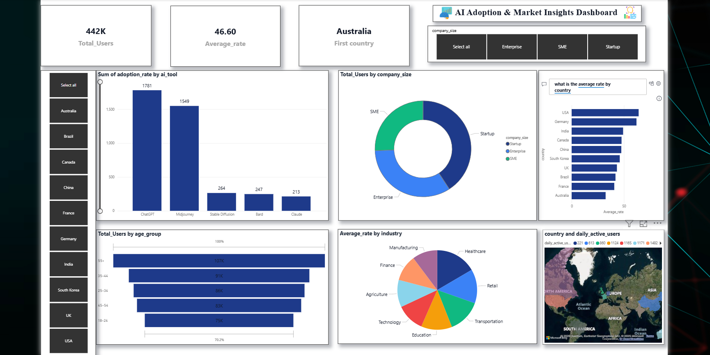

# AI-_Adoption_Data_Analysis
An interactive Power BI dashboard analyzing global AI adoption trends across countries, industries, age groups, and company sizes. Provides insights on user demographics, top AI tools, and adoption rates for strategic decision-making.  Tech Stack: Power BI | Data Visualization | Business Analytics

# AI Adoption & Market Insights Dashboard

An interactive Power BI dashboard analyzing **global AI adoption trends** across countries, industries, age groups, and company sizes. This dashboard provides **data-driven insights** to help businesses and decision-makers understand AI market penetration and usage patterns.

---

## 📊 **Key Features**
- **442K Total Users** analyzed for AI tool adoption.
- **Country-wise Analysis:** Compare adoption and engagement across regions.
- **Company Size Breakdown:** Startups, SMEs, and Enterprises.
- **Top AI Tools:** ChatGPT, Midjourney, Stable Diffusion, and more.
- **Demographics:** Age group distribution of users.
- **Industry Insights:** Adoption trends across Technology, Healthcare, Finance, Education, etc.
- **Daily Active Users:** Visualized on a global map.

---

## 🛠 **Tech Stack**
- **Power BI** – For dashboard creation and data visualization.
- **Excel / CSV** – For raw data storage and integration.

---

## 📸 **Dashboard Preview**

---

## 📂 **Project Structure**
